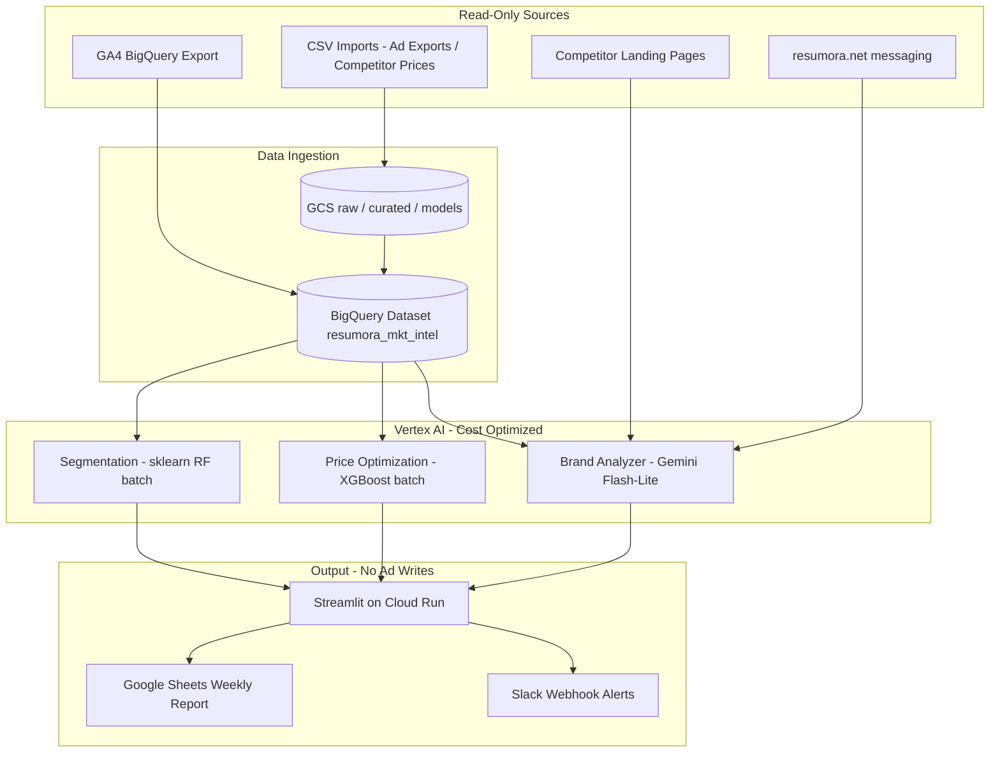

# Resumora Marketing Intelligence Layer

Standalone Google Cloud AI marketing intelligence for **resumora.net**.

> **Hard rule:** This system is **read-only** with respect to advertising platforms.  
> It never writes back to Meta Ads, Google Ads, LinkedIn Ads, TikTok Ads, or any campaign APIs.  
> Existing social media ad campaigns are untouched.

## Architecture



## Cost Targets (MVP)

| Service | Strategy | Typical monthly |
|---------|----------|-----------------|
| BigQuery | On-demand, partition/cluster, free tier first | $2–15 |
| Gemini | **Flash-Lite** daily brand scrape; batch where possible | $1–5 |
| Pricing ML | Local/Cloud Run batch training (not online endpoints) | $0–5 |
| Cloud Run | Streamlit dashboard + jobs | $0–18 |
| Scheduler / Storage | Minimal jobs | ~$0–1 |
| **Total** | Free-tier maximized | **~$3–78** |

## Project Layout

```
resumora-marketing-intel/
├── src/marketing_intel/     # Python package
├── dashboard/               # Streamlit app
├── terraform/               # IaC
├── sql/schemas/             # BigQuery DDL
├── scripts/                 # deploy / quickstart
├── samples/csv/             # Example competitor pricing CSV
├── config/                  # Non-secret defaults
├── tests/
└── docs/
```

## Quickstart (local)

```bash
# From Git Bash / WSL / macOS / Linux
cd /d/BossMind/resumora-marketing-intel   # or your path
./scripts/quickstart.sh
```

PowerShell:

```powershell
cd D:\BossMind\resumora-marketing-intel
.\scripts\quickstart.ps1
```

## Setup

1. Copy `.env.example` → `.env` and fill GCP project + Slack webhook (optional).
2. Copy `terraform/terraform.tfvars.example` → `terraform/terraform.tfvars`.
3. Apply infra (cost controls enforced):

```bash
cd terraform
terraform init
terraform plan
terraform apply
```

Or: `./scripts/deploy.sh`

4. Train MVP models locally: `python -m marketing_intel.jobs.train_models`.
5. Run dashboard: `streamlit run dashboard/dashboard_app.py`.
6. Cloud Run image (job API for Scheduler):

```bash
gcloud builds submit --tag gcr.io/resumora-live/resumora-mkt-intel:latest
# then set cloud_run_image in tfvars and re-apply
```

### Terraform layout (cost-optimized)

```
terraform/
├── main.tf
├── variables.tf
├── outputs.tf
├── terraform.tfvars.example
└── modules/
    ├── bigquery/     # partition + cluster + table expiration
    ├── vertex-ai/    # batch endpoint only (idle ~$0)
    ├── cloud-run/    # min_instance_count = 0
    ├── scheduler/    # daily / weekly / monthly jobs
    └── storage/      # lifecycle Nearline→Coldline→Delete + SA
```

| Control | Effect |
|---------|--------|
| Cloud Run `min_instance_count = 0` | $0 when idle |
| Vertex batch endpoint (no always-on nodes) | $0 when idle |
| BQ partition + cluster + 90d expiration | Lower scan + storage |
| GCS lifecycle 30/90/365 | 60–85% storage savings |
| Budget alert 90%/100% (optional) | Surprise-bill guard |

## Safety Guarantees

| Action | Allowed? |
|--------|----------|
| Read GA4 export / BQ analytics | Yes |
| Import CSV exports *from* ad platforms | Yes (offline files only) |
| Write/update Meta/Google/LinkedIn campaigns | **No** |
| Change Stripe live prices automatically | **No** (recommendations only) |
| Scrape competitor public pages | Yes (1×/day, polite) |

Pricing recommendations are **advisory**. A human must approve any live price change on resumora.net.

### Core modules (drop-in)

| File | Role |
|------|------|
| `modules/bigquery_client.py` | BQ query / insert / user_behavior |
| `modules/pricing_model.py` | `PricingOptimizer` (sklearn RF) |
| `modules/brand_analyzer.py` | Gemini Flash-Lite brand gap |
| `dashboard/app.py` | Streamlit UI wired to the three modules |

```powershell
cd D:\BossMind\resumora-marketing-intel
streamlit run dashboard\app.py
```

CI/CD: see `docs/GITHUB_ACTIONS.md` and BossMind workflow `.github/workflows/marketing-intel-deploy.yml`.


## License

Internal BossMind / Resumora use only.
